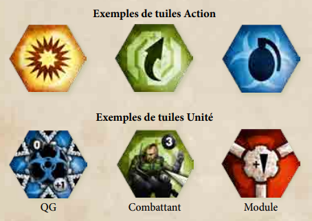
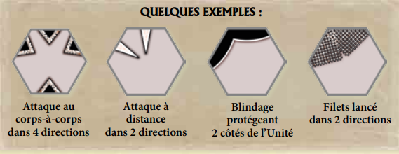
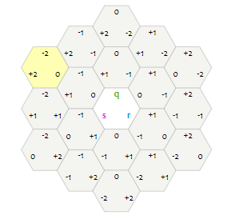
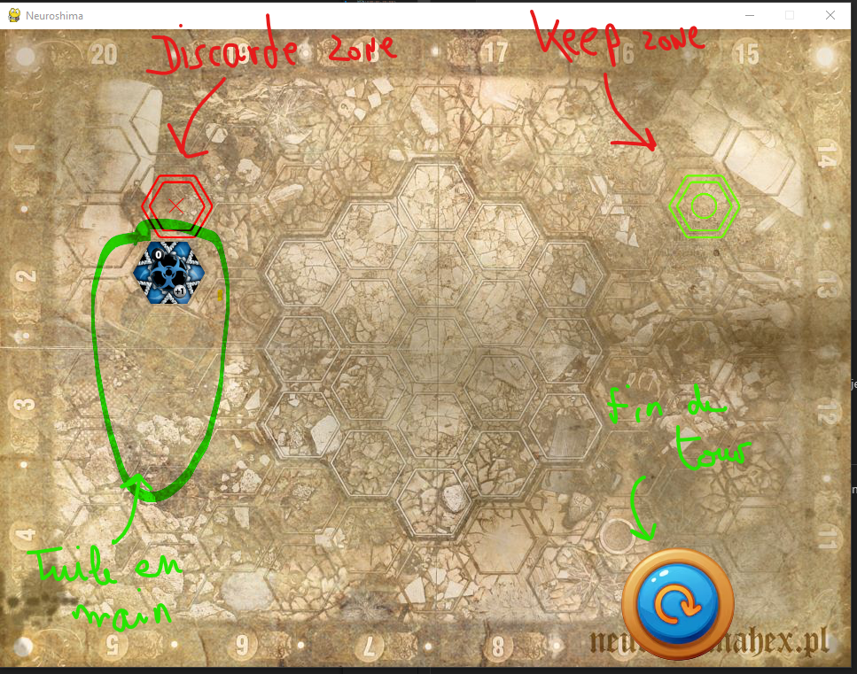
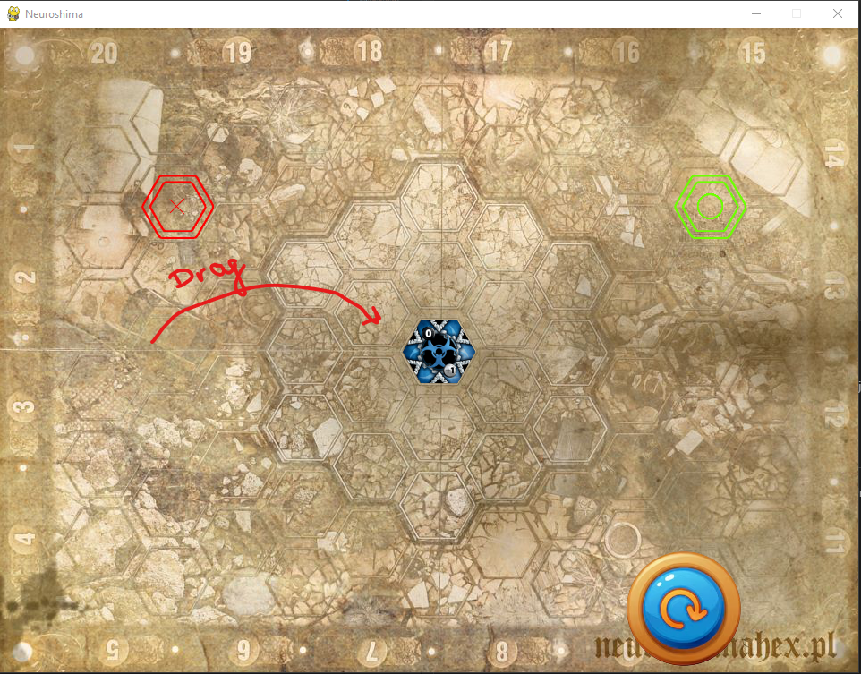

# Neuroshima Game

Ce projet à pour objectif de reproduire le jeu de plateau Neuroshima Hex ([site web neuroshima](https://neuroshima-hex.azharis.fr/)).
Je n'ai aucune licence ni droit, d'où le repo en privé.

Seul l'affrontement en 1 contre 1 (constituant le mode de jeu principal) sera implementé ici. Les joueurs devront jouer sur le même pc.

ATTENTION : le script n'est pas encore terminé. On peut actuellemnt juste générer des phases de jeux entre joueurs consistant juste à poser des tuiles sur le borde

## Règle du jeu
[LIEN REGLE EN LIGNE](https://neuroshima-hex.azharis.fr/rs/NH3_regles_FR.pdf)

Sinon voila un résumé :

Le jeu se joue sur un board hexagonal constitué de 19 hexagones.

Chaque joueur possède une armée constitué de 35 tuiles dont une tuile QG (exemple armée [moloch](https://neuroshima-hex.azharis.fr/armee/tuiles/moloch.html))

#### But du jeu : 
Le but de chaque joueur est d'attaquer le Quartier Général (QG) de son
adversaire. Au début de la partie, chaque QG dispose de 20 « Points de Vie ».
Si, au cours de la partie, un QG perd son dernier Point de Vie, il est détruit etle joueur le contrôlant est éliminé de la partie.

Si, à la fin de la partie, aucun QG n'a été détruit, les joueurs comparent le nombre de Points de Vie de leurs QG. Le joueur dont le QG est le moins endommagé (qui a le plus de Points de Vie) remporte la partie

#### Phases de jeu:
##### 1. Initiation du jeu : 
Chaque joueur mélange son deck constitué des tuiles face cachée (sans qg) et le premier joueur est tiré aleatoirement.

Le premier joueur puis le second posent chacun leur qg sur le borde
##### 2. Tour joueur
À son tour, un joueur pioche des tuiles jusqu'à en avoir 3 (c'est-à-dire qu'à
aucun moment il ne peut avoir plus de 3 tuiles devant lui) et les place face
visible devant lui. 
Cas particulier : on tire qu'une tuile au tour 1 et 2 au tour 2 afin d'équilibrer le début.

Il doit, avant toute autre chose, défausser une de ces 3 tuiles (généralement la moins utile) dans sa défausse. Il choisit ensuite ce qu'il fait avec chacune des 2 tuiles restantes : il peut les jouer, les conserver pour les tours à venir ou les défausser.

Remarque : je n'ai pas encore codé l'obligation de devoir defausser une tuile

Un joueur peut défausser n'importe quel nombre de tuiles qu'il a piochées.
Les tuiles piochées doivent être visibles des deux joueurs et placées face visible devant le joueur qui les pioche.

Il y a deux types de tuiles dans le jeu : les tuiles Action et les tuiles Unité. Ces deux types sont bien différenciés afin d'être facilement identifiés : les tuiles Action présentent un 
grand et unique pictogramme noir alors que les tuiles Unité contiennent davantage d'informations.
Les tuiles actions représentent des actions spécifiques et immédiates. Elles ne sont pas placées sur le plateau de jeu.
Les tuiles Unité représentent les Unités de votre armée. Chaque armée dispose de 3 types d'Unités : un QG, des Combattants et des Modules. Pour jouer une tuile Unité, le joueurla place sur un hexagone libre de son choix surle plateau.

Si, avant la fin de la partie, un des joueurs pioche sa dernière tuile Armée mais
qu'il a moins de 3 tuiles devant lui, il n'est pas obligé d'en défausser.
Une fois qu'un joueur a fini son tour (piocher, jouer ou défausser des tuiles et
résoudre les actions désirées), il en informe son adversaire

##### 3. Phase de combat
Si le board se retrouve remplit ou si un joueur joue une tuile action déclanchant un combat, une phase de combat est engagée.
Les effets des tuiles sont appliqués par ordre d'initiative (chiffre en noir sur les tuiles unités). Les effets des modules sont permanent tant que ceux ci sont sur le borde.
Le combat se déroule par phase d'initiative de la plus grande à la plus petite. A chaque phase les tuiles unités appliquent leurs dégats autres.

Le combat se termine quand toutes les phases d'initiative ont été faites.
Plus de détail dans le lien vers les règles en ligne. page 5,6,7 Je n'ai pas encore eu le temps de générer les batailles dans ce projet. 
[LIEN REGLE EN LIGNE](https://neuroshima-hex.azharis.fr/rs/NH3_regles_FR.pdf)

##### 4. Fin de partie et Victoire 

Une fois que l'un des joueurs pioche la dernière tuile de son Armée, il joue son tour normalement. Son adversaire joue ensuite un dernier tour et le Combat Final s'engage.

La partie se termine après le Combat Final ou dès que les Points de Vie d'un QG sont réduits à zéro.

Si l'un des QG est détruit, la partie s'achève et le joueur dont le QG est encore debout l'emporte.

Si l'un des QG est détruit lors d'un Combat, la partie ne s'achève qu'à la fin de celui-ci. Si l'autre QG est également détruit, la partie s'achève sur un match nul.

Si aucun des QG n'est détruit à la fin du Combat Final, le joueur contrôlant le QG ayant le plus de Points de Vie est le gagnant

## EXPLICATION CODE

Tout le script se trouve dans le dossier "scripts"
Le code est construit autour d'un motif Modèle-vue-contrôleur (M-V-C).

- le modèle (model_script.py) contient les données à afficher ;
- la vue (view.py) contient la présentation de l'interface graphique ;
- le contrôleur (controler_script.py) contient la logique concernant les actions effectuées par l'utilisateur

Le fichier "function.py" : contient des fonctions génériques.
le fichier "battleevaluator.py" : module pas encore terminé. permettra de gérer le déclanchement des combats dans le modul "controler_scripts"

Le scripts se base essentiellement sur la bibliothèque Pygame de python pour générer les différents élements du jeu.

---
### MODEL 

Le model contient les différents éléments du jeu, représentés par des class:
- Class Tile : représente une tuile. S'initialise avec toutes les caractéristiques d'une tuile (type, attaque, point de vie etc...)
- Class Deck : représente le deck d'une armée, c'est à dire 35 instances de Tile initialisés grâce aux fichiers du dossier scripts/armies. 
- Class Hand : représente la main d'un joueur, c'est à dire les 3 tuiles disponibles en début d'un tour
- Class Player : représente un joureur. Il possède une instance de Deck et de main
- Class HexBoard : représente le plateau de jeu. Les tuiles jouées y sont enregistrés dans des attributs.

#### Remarque position et l'angle de rotation des tuiles :

La position sur board sont des coordonnées cubiques (q,r,s):

Les attaques des tuiles, filets et shields sont aussi définits par des coordonnées. 
C'est coordonnées représentes l'angles par rapport à la position (0,0,0) sur le board et donc la direction vers laquelle l'attaque (ou autre) à lieu.

Un index a été definit selon l'angle de rotation de la tuile. Celui ci permet de recalculer les directions des attributs attaque, shields et filets de la tuile sui celle ci a été rotatée

### VIEW

un sprite est un objet de la bibliothèque pygame. Cela représente en qlq sorte un image

Le fichier view.py contient les différens éléments à afficher représentés chacun par une class. Ils sont utilisés dans la Class View du fichier.
liste des élements utilisés dans la class View:
 - TileView : représente une tuile sous forme d'un sprite avec quelques caractéristiques en plus
 - Hexagone : représente un hexagone (une zone) du board
 - BoardZone : représente l'ensemble des hexagones sur le board
 - EndButton : button permettant la fin du tour
 - RerollButton : Pas encore utilisé, permettra de re-initialiser le tour
 - DiscardZone : Zone permettant de jeter une tuile. Ils suffit de faire glisser une tuile dessus
 - KeepZone : Zone permettant de conserver une tuile pour le tour suivant du joueur. Ils suffit de faire glisser une tuile dessus. Attention c'est zone ne marche pas pour le moment
 - Button : permet de générer un bouton sur une position donnée du board

Ici les position des tuiles sont calculés par rapport à la posistion (x,y) des pixels de l'écran

Board positions : 

                                8  (451,155)
                    4 (377,198)               13 (525,199)
        1 (302,241)             9  (451,241)                17 (599,242)
                    5 (376,284)               14 (525,284) 
        2 (301,326)             10 (451,327)                18 (598,328)
                    6 (376,369)               15 (525,370) 
        3 (301,411)             11 (450,413)                19 (598,413)
                    7 (376,455)               16 (524,455)
                                12 (450,499) 

Le liens entre les pixels et les coordonnées cubes sont le ssuivants :

    {1:[(302,241), (-2,0,2)], 
    2:[(301,326), (-2,1,1)],
    3:[(301,411), (-2,2,0)],
    4:[(377,198), (-1,-1,0)],
    5:[(376,284), (-1,0,-1)],
    6:[(376,369), (-1,1,0)],
    7:[(376,455), (-1,2,-1,)],
    8:[(451,155), (0,-2,2)],
    9:[(451,241), (0,-1,1)],
    10:[(451,327), (0,0,0)],
    11:[(450,413), (0,1,-1)],
    12:[(450,499), (0,2,-2)],
    13:[(525,199), (1,-2,1)],
    14:[(525,284), (1,-1,0)],
    15:[(525,370), (1,0,-1)],
    16:[(524,455), (1,1,-2)],
    17:[(599,242), (2,-2,0)],
    18:[(598,328), (2,-1,-1)],
    19:[(598,413), (2,0,-2)]}

### CONTROLER
Ce module fait le lien entre le model et la vue.
La fonction lançant le jeu est GameController.run()

## LANCEMENT DU JEU

Le jeu s'effectue en executant le script "scripts/controler_script.py". Un scripts "main.py" sera fait plus tard pour simplifier le lancement.

une fenetre alors s'ouvre

on peut alors drag and drop la tuile qg sur le board et ensuite cliquer sur le button fin de tour. L'opération se repète alors pour le prochain joueur.

Ensuite les joueurs pourront tirer des tuiles et les jouer. Comme les QG les tuiles sont a poser (drag and drop) sur le board. Un clique droit sur une tuile permet de la rotater.

Pour les tuiles actions, des zones en surbrillance sont afficher pour les actions. Seul la tuile combat (tuile avec une sorte d'explosion dessus) ne fait rien pour le moment car je n'ai pas encore codé les combats.

